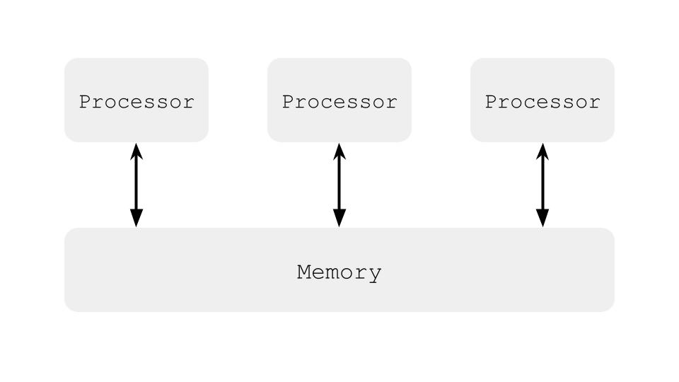
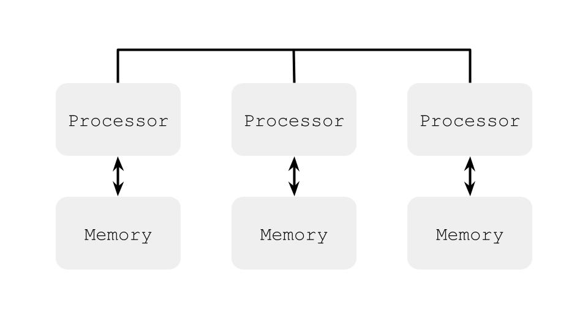

# Лекция 1.1. Введение и мотивация

---
### Закон Мура и «The free lunch is over?»
Количество транзисторов удваивается каждые два года, частота ядра раньше также росла экспоненциально, но в двухтысячных перестала. Производительность отдельно взятого ядра с тех пор стала расти медленнее, стали ускоряться за счёт большего числа ядер.
### Закон Амдала
`N` – число потоков, `P` – доля параллельного кода, `S` - ускорение кода

$$
S = \frac{Time\ on\ 1\ core}{Time\ on\ N\ cores} = \frac{1}{1 - P + \frac{P}{N}}
$$

при \\(N \to \infty \\) максимальное ускорение кода \\( \frac{1}{1 - P} \\)

### Параллелизм на уровне инструкций (ILP)
Нет зависимости по данным, (1) и (2) можно выполнить параллельно.
```java
e = a + b // 1
f = c + d // 2
```
Способы использования ILP:
* Конвейер
* Суперскалярное исполнение
	* Внеочередное исполнение
	* Переименование регистров
	* Спекулятивное исполнение
	* Предсказание переходов
* Длинное машинное слово (VLIW)
* Векторизация (SIMD)

## Примеры архитектуры многопроцессорных компьютеров
### Симметричная мультипроцессорность (SMP)


### Ассиметричный доступ к памяти (NUMA)


Виды многопоточных систем:
* Одновременная многопоточность (SMT) – в каждый данный момент может исполняться несколько потоков.
* Временная многопоточность (TMT) – в каждый данный момент может исполняться только один поток.

## Операционные системы
### Типы операционных систем
* Однозадачные
* Система с пакетными заданиями (batch processing)
* Многозадачные / с разделением времени (time-sharing)
	* Кооперативная многозадачность (cooperative multitasking)
	* Вытесняющая многозадачность (preemptive multitasking)

### Основные понятия в современных ОС
* Процесс – владеет памятью и ресурсами. ОС создаёт иллюзию того, что каждый процесс имеет абстрактную вычислительную систему в своём полном распоряжении.
* Поток – контекст исполнения внутри процесса. В одном процессе может быть несколько потоков, все потоки работают с общей памятью процесса.
* В научных работах исторически сложилось называть потоки процессами и использовать большие буквы: `P`, `Q`, ...

В теории мы их будем смешивать, хоть это и некорректно

## Формализм
Нужна формальная модель параллельных вычислений для того, чтобы использовать её в доказательствах корректности алгоритмов, а также невозможности построения тех или иных алгоритмов и минимально-необходимые требования для тех или иных алгоритмов.

А ещё формальная модель нужна для формализации отношений между прикладным программистом и разработчиком компилятора и системы исполнения кода.

### Модели программирования
* «Классическое» однопоточное / однозадачное (можем использовать ресурсы многоядерной системы только запустив множества разных, независимых задач)
* Многозадачное программирование (можем использовать ресурсы многоядерной системы в рамках решения одной задачи)
	* Модель с общей памятью (рассматриваем в рамках этого курса)
	* Модель с передачей сообщений (распределенное программирование)

### Общие объекты
Потоки выполняют действия над общими, разделяемыми объектами. В этой модели не важны операции внутри потоков: вычисления, обновления регистров процессора, обновления регистров потока.

#### Общие переменные
Это простейший тип общего объекта, базовый строительный блок для многопоточного алгоритма. У общих переменных есть операции чтения и записи, а также значение определенного типа.

__Модель с общими переменными__ – это хорошая абстракция современных многопроцессорных систем и многопоточных ОС. На практике, это общая память процесса, которая доступна для чтения и записи всем потокам, исполняемым в данном процессе.

_В теоретических трудах общие переменные часто называют регистрами._

Многопоточные программы в общем случае недетерминированы, в отличие от однопоточных программ. Поэтому мы говорим, что __программа А имеет свойство Р__, если программа А имеет свойство Р __при любом исполнении__.

### Моделирование работы программы

Рассмотрим модель чередования, где исполнение потоков чередуется в произвольном порядке. Тогда у нижеуказанной программы есть три исхода, она не может завершиться в состоянии `{0, 0}`.
```java
@JCStressTest
@State
@Outcome(id = "0, 1", expect = Expect.ACCEPTABLE)
@Outcome(id = "1, 0", expect = Expect.ACCEPTABLE)
@Outcome(id = "1, 1", expect = Expect.ACCEPTABLE)
public class SimpleTest1 {
    int x;
    int y;
    
    @Actor 
    public void threadP(IntResult r) {
        x = 1;
        r.r2 = y;
    }
    
    @Actor 
    public void threadQ(IntResult r) {
        y = 1;
        r.r1 = x;
    }
}
```

Однако на практике у нас всё сломалось, все четыре результата возможны, при этом `{1, 1}` реже всех. Почему? Потому что тестировали на TSO (Total Store Order) модели памяти, где операции записи кладутся в буфер, и чтение в некоторых случаях было выполнено раньше, чем запись «дошла» до памяти.
