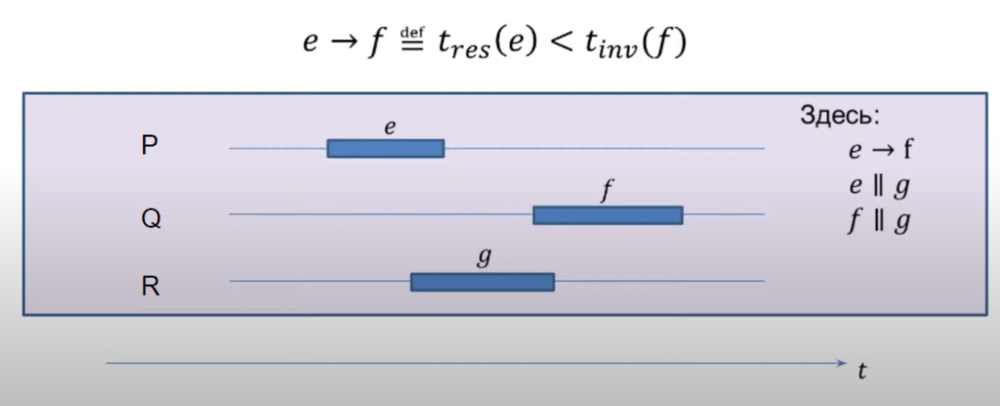
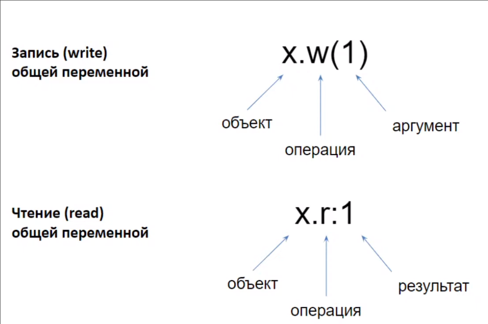
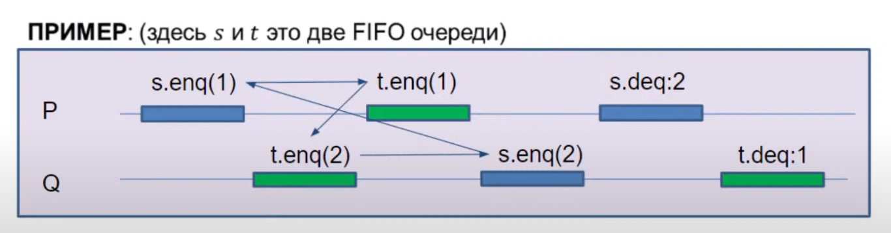
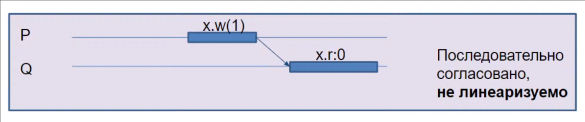
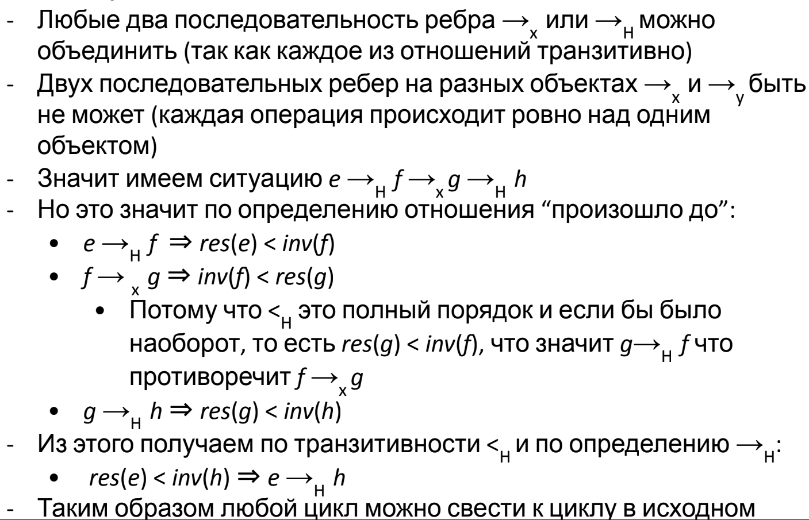

# Лекция 2.1. Определения и Формализм

## Физическая реальность

Как мы узнали на прошлой лекции, модель чередования фундаментально ошибочна — она не предполагает реально параллельное исполнение. Кроме того, в реальном мире невозможно синхронизироваться — за один такт свет не успеет физически дойти от ядра до ядра.

На физических событиях в целом нельзя построить отношение полного порядка.

## Модель "произошло до"

**Исполнение** системы это пара \\((H, \to_H)\\) (history)
- \\(H\\) - множество базовых операций \\(e, f, g \dots\\) (чтение и запись памяти)
- \\(\to_H\\) - частичный (транзитивный, антирефлексивный, ассиметричный) порядок на операциях, называемый "произошло до в исполнении \\(H\\)"

Идейно мы в этой модели поддерживаем параллелизм, т.к. нет требования полного порядка.

Операции \\(e\\) и \\(f\\) параллельны, если \\(e \not\to f \operatorname{\\&} f \not\to e\\), это обозначается \\(e \parallel f\\)

Сложная операция \\(e\\) состоит из двух простых событий: \\(inv(e)\\) и \\(res(e)\\) (invoke, result).

Простые события **полностью** упорядочены отношением \\(<_H\\). По определению \\(e \to_H f\\) тогда и только тогда, когда \\(res(e) <_H inv(f)\\). Так как порядок полный, у нас есть глобальное время.

**Система** — набор всех возможных исполнений системы.

На практике отношение "произошло до" предоставляется моделью памяти языка. (`std::atomic`, `volatile`, создание и `join` потоков, либы)

### Последовательное исполнение

Исполнение системы **последовательно**, если все операции линейно упорядочены отношением \\(\to\\), то есть:
$$\forall e, f \in H : (e = f) \lor (e \to f) \lor (f \to e)$$

## Конфликты и гонки данных

Если одна из двух операций над одной и той же переменной - запись, то эта пара операций называется **конфликутующей**, они не коммутируют.

Если при конкретном исполнении две конфликтующие операции произошли параллельно, то произошла **гонка данных**.

Программа называется **корректно синхронизированной**, если при любом допустимом (по спеку языка) исполнении нет **гонок данных**.

## Правильное исполнение

**Сужение** исполнения \\(H\\) на поток \\(P\\) это исполнение, где остались только операции, происходящие в потоке \\(P\\). Обозначается \\(H\mid_P\\).

Исполнение **правильное**, если его сужение на каждый поток является **последовательным**. Мы рассматриваем только такие исполнения.

В реальности современные процессоры в силу конвейерности не последовательны в рамках одного ядра, но это спрятано от юзера. 

**Программный порядок (program order)** - сужение отношения "произошло до" на отдельные потоки.

Сужение истории \\(H\\) на объект \\(x\\) - множество операций над \\(x\\), обозначается \\(H\mid_x\\)

## Допустимое исполнение

Последователньая спецификация объекта проверяется на любом последовательном сужении истории на объект. Если она выполнена, то исполнение **допустимо**.

Но какое параллельное исполнение допустимо? Если получится сопоставить допустимое последовательно исполнение, то наше параллельное исполнение будем считать допустимым.

Однако есть разные варианты сопоставления, они называются **условия согласованности**. Есть базовое требование к условиям - корректные последовательные программы должны быть согласованы при их однопоточном исполнении.

Нас интересуют только два условия: последовательная согласованность (sequential consistency) и линеаризуемость.

### Последовательная согласованность

Исполнение **последовательно согласованно**, если можно сопоставить эквивалентное ему допустимое последовательное исполнение, которое сохраняет **программный порядок** – порядок операций на каждом потоке.

Есть одна проблема - последовательно согласованное исполнение на нескольких объектах по отдельности не последовательно согласовано в целом.

Таким образом, нет смысла говорить, что отдельный объект последовательно согласован; надо говорить про систему в целом. Например, JMM последовательно согласована.

### Линеаризуемость

Исполнение **линеаризуемо**, если можно сопоставить эквивалентное ему допустимое последовательное исполнение, которое сохраняет порядок "произошло до".

Это самый строгий критерий.

*Теорема:* исполнение линеаризуемо тогда и только тогда, когда линеаризуемо исполнение на каждом объекте по отдельности.

*Доказательство:*
- *Тогда:* очевидно.
- *Только тогда:* Объединим линеаризацию на каждом объекте \\(\to_x\\) и исходное \\(\to_H\\). Транзитивно замкнём полученное отношение. Докажем от противного, что замыкание ациклично.

Операции над линеаризуемыми объектами называются **атомарными**.

#### Линеаризуемость в глобальном времени

В глобальном времени исполнение линеаризуемо тогда и только тогда, когда можно выбрать точки линеаризации \\(e\\) такие, что \\(t_{inv}(e) < t(e) < t_{res}(e)\\)

Исполнение системы с операциями над линеаризуемыми объектами можно анализировать в модели чередования.

### В JMM

Операции над `volatile` полями линеаризуемы, а над не `volatile` полями нарушена даже последовательная согласованность (без синхронизации). Если же программа корректно синхронизирована, то есть нет гонок, то JMM гарантирует последовательно согласованное исполнение даже не над `volatile` переменными.

В реальности компилятор вставляет инструкцию `mfence`, который сбрасывает буфер записи.

`volatile` это медленно.
