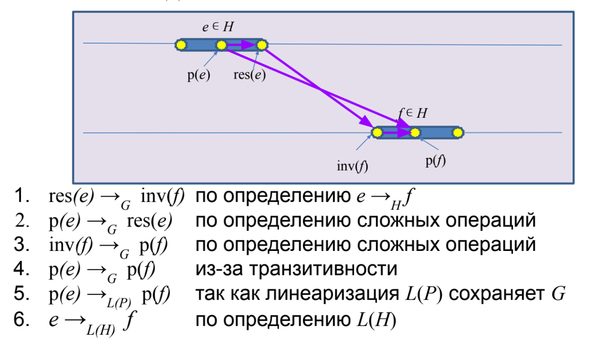
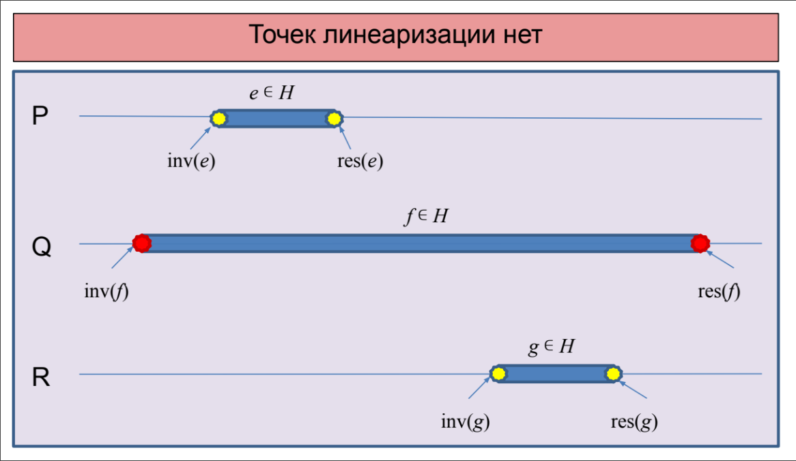

# Лекция 2.2. Построение атомарных объектов и блокировки

**Декомпозиция исполнения** это пятерка \\(H, G, \to_G, inv, res\\), где 
- \\(H\\) это множество операций, \\(\forall e \in H : e \subset G\\)
- \\(G\\) это множество событий
- \\(\to_G\\) - отношение "произошло до" на \\(G\\)
- \\(inv, res : H \to G\\)
  - \\(\forall e \in H : inv(e) \to_G res(e)\\)
  - Все точки \\(e\\) лежат между \\(inv\\) и \\(res\\): \\(\forall e \in H, g \in e, g \neq inv(e), g \neq res(e): inv(e) \to_G g \to_G res(e)\\)

$$\forall e, f \in H : E \to_H f \stackrel{def}{=} res(e) \to_G inv(f)$$

Исполнение \\(H, \to_H\\) **линеаризуемо**, если можно найти исполнение \\(L(H), \to_{L(H)}\\), называемое **линеаризацией** \\(H\\), такое что:
- \\(L(H) = H\\) 
- Сохраняется старое отношение \\(\to_H\\): \\(e \to_H f \implies e \to_{L(H)} f\\)
- Исполнение последовательно: \\((e = f) \lor (e \to_{L(H)} f) \lor (f \to_{L(H)} e)\\)
- \\(L(H)\\) допустимо, т.е. выполняет последовательные спецификации всех объектов

**Точки линеаризации** это функция \\(p : H \to G\\) вместе с линеаризацией \\((L(P), \to_{L(P)})\\), где \\(P = p(H)\\)

_Теорема:_ Исполнение \\(H\\) линеаризуемо тогда и только тогда, когда можно выбрать точки линеаризации \\(p\\) согласовано с линеаризацией, т.е. \\(e \to_{L(H)} f \iff p(e) \to_{L(P)} p(f)\\)

## Есть точки линеаризации \\(\implies\\) линеаризуемо

Определим \\(L(H)\\) как \\(e \to_{L(H)} f \iff p(e) \to_{L(P)} p(f)\\), тогда старое отношение сохраняется, исполнение последовательно (порядок полный) и допустимо. Докажем, что \\(\to_{L(H)}\\) сохранняет \\(\to_H\\).



## Линеаризуемо \\(\implies\\) есть точки линеаризации



Это неверно. Однако, можно доопределить точки и тогда искомое очевидно верно.
В частности, в модели глобального времени можно найти искомые точки.

Таким образом, для доказательство линеаризуемости достаточно предъявить точки линеаризации, но их может не быть и тогда надо доказывать по-другому (сложно).

Если объект линеаризуем, то можно опустить детали его реализации.

Пусть мы написали в псевдокоде:
```python
def seq:
    op1
    op2
```
Тогда \\(op1 \to op2\\) и \\(inv(seq) := inv(op1), res(seq) := res(op2)\\) и каждая строчка атомарна, что позволяет нам анализировать через чередование.

Не любой линеаризуемый алгоритм можно реализовать таким образом.

## Блокировки

Mutex = mutual excluesion = lock = блокировка. Обладает свойством **взаимного исключения**, т.е. что выполнение критических секций не может быть параллельным, а следовательно оно будет линеаризуемо. Это требование **корректности** протокола взаимной блокировки.

### Первая попытка

```python
shared boolean want
def lock:
    while want:
        pass
    want = True

def unlock:
    want = False
```

Не работает, т.к. два потока могут увидеть `want == false`, записать `want = true` и перейти в критическую секцию.

### Вторая попытка

```python
threalocal int id # 0 or 1
shared boolean want[2]

def lock:
    want[id] = True
    while want[1 - id]:
        pass

def unlock:
    want[id] = False
```

Докажем взаимное исключение от противного через чередование, т.к. все строки атомарны.

Пусть два потока зашли одновременно в критическую секцию. Тогда поток `id` зашел последним в то время, как поток `1 - id` уже был в секции. Но в секцию можно зайти только после чтения `want[1 - id] == false`, это противоречит тому что `1 - id` в секции.

Однако, есть проблема - оба потока могут записать `want[id] = true` и вечно ждать друг друга.

Добавим новое условие: **отсутствие взаимной блокировки (deadlock-freedom)**: если несколько потоков пытаются войти в критическую секцию, то хотя бы один из них должен войти в критическую секцию за конечное время (если критические секции выполняются за конечное время).

### Третья попытка

```python
threalocal int id # 0 or 1
shared int victim

def lock:
    victim = id
    while victim == id:
        pass

def unlock:
    pass
```

Доказать взаимное исключение тривиально (как в попытке 2). Докажем deadlock-freedom. Если два потока одновременно крутятся в цикле, то `victim == 0 & victim == 1` - противоречие.

Есть другая проблема - если второй поток не хочет зайти в секцию, то `victim == 0` всегда и первый поток не зайдёт.

Добавим третье условие: **отсутствие голодания (stavation-freedom)**: если какой-то поток пытается войти в критическую секцию, то он войдёт в критическую секцию за конечное время (если критические секции выполняются за конечное время).

### Алгоритм Петерсона

```python
threadlocal int id # 0 or 1
shared boolean want[2]
shared int victim

def lock:
    want[id] = true
    victim = id
    while want[1 - id] and victim == id:
        pass

def unlock:
    want[id] = false
```

Гарантирует все наши условия.

Докажем взаимное исключение. Пусть поток `id` зашел в CS последним, когда `1 - id` уже был в CS. Тогда либо `want[1 - id] == false` или `victim != id`.
1. `want[1 - id] == false`. Это противоречит тому что `want[1 - id] == true`, т.к. `1 - id` в CS.
2. `victim != id`.
   - Если `1 - id` зашел по причине `victim != 1 - id`, то противоречие.
   - Остается случай `1 - id` зашел по причине `want[id] = false`, но тогда он зашел до исполнения первой строки потоком `id`, но тогда для потока `id` выполнено `victim == id`.

Взаимной блокировки нет в силу `victim`.

Голодания нет т.к. `want[1 - id] == false`.

Таким образом, для реализации лока достаточно иметь атомарные регистры чтения/записи.

## Алгоритм Петерсона для N потоков

```python
threadlocal int id # 0 to N - 1
shared int level[N]
shared int victim[N]

def lock:
    for j in 1 .. N - 1:
        level[id] = j
        victim[j] = id
        while exist k: k != id and level[k] >= j and victim[j] == id:
            pass

def unlock:
    level[id] = 0
```

Удовлетворяет тем же требованиям, но алгоритм не очень честный. Невезучий поток может ждать, пока другие потоки \\(\mathcal O(N^2)\\) раз войдут в критическую секцию. Хотелось бы ждать линейно.

## Алгоритм Лампорта (булочника)

```python
threadlocal int id # 0 to N - 1
shared boolean want[N] init false
shared int label[N] init 0

def lock:
    want[id] = true
    label[id] = max(label) + 1
    while exists k: k != id and want[k] and (label[k], k) < (label[id], id):
        pass

def unlock:
    want[id] = false
```

Идея: получаем номерок `label`, который больше всех предыдущих. Но может быть проблема: разные потоки получили один и тот же номер. Поэтому сравниваются не только номерки, но и номера потоков.

Ключевое свойство: если поток P выполнил первые две строки до Q, то он войдёт в секцию раньше. Это более сильное требование, называемое **First come, first served**:
1. Метод `lock` состоит из двух последовательных секций:
```python
def lock:
    doorway
    waiting
```
2. Секция `doorway` является `wait free` (не ждём другие потоки)
3. Пусть время исполнения `doorway` это \\(DW_i\\), а операций `waiting` это \\(WT_i\\).
4. Если \\(DW_i \to DW_j\\), то \\(res(WT_i) \to re(WT_j)\\).

Это немножко нечестно - метки должны быть бесконечными. Однако, можно устроить "бесконечные" метки на конечных регистрах.

Обычно говорят, что алгоритм **честный**, если он **FCFS**.

Блокировка позволяет избежать гонок.

## Test-and-set (compare-and-set) spin lock

```python
def lock:
    while !locked.CAS(0, 1):
        pass

def unlock:
    locked = 0
```

На практике мы не хотим кушать CPU, пока ждём, поэтому немного spinимся, а потом спим через ОС. На реальном железе не масштабируется и в реальности не используется.


## Тонкая блокировка

Мы хотим использовать различные блокировки на разных переменных. Но это опасно - можно получить неверное исполнение. Например:


Есть принцип **2-Phase Locking**:
1. Берём блокировки на все необходимые объекты
2. Выполняем операцию
3. Отпускаем все блокировки

Брать и отпускать блокировки можно в любом порядке.

2PL всегда линеаризуемо (точка линеаризации между фазами).

Все следующие операции 2PL:

```python
def proc1:
    mutex1.lock
    mutex2.lock
    obj1.work
    obj2.work
    mutex2.unlock
    mutex1.unlock
```

```python
def proc2:
    mutex1.lock
    obj1.work
    mutex2.lock
    obj2.work
    mutex2.unlock
    mutex1.unlock
```

```python
def proc3:
    mutex1.lock
    mutex2.lock
    obj1.work
    obj2.work
    mutex1.unlock
    mutex2.unlock
```

С помощью блокировок можно сделать любой объект линеаризуемым. Однако есть проблема: может произойти deadlock - если два процесса ждут друг друга (с двумя блокировками). Это решается с помощью выстраивания блокировок в иерархию, где мы захватываем сначала более приоритетные блокировки.
