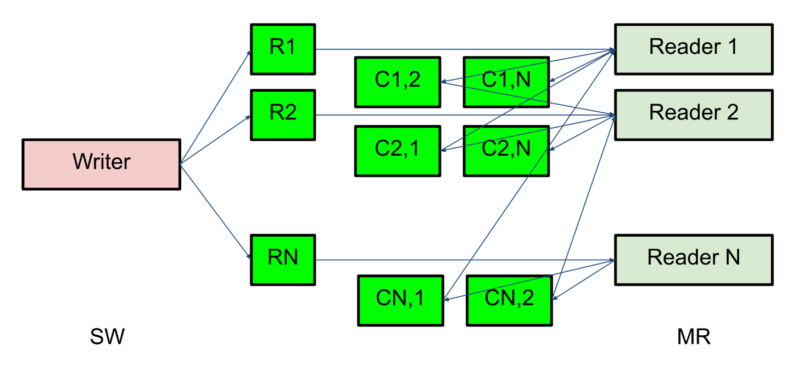

# Лекция 4.1. Алгоритмы без блокировок: Построения на регистрах

Мы не можем требовать, чтобы алгоритм не использовал блокировку, ибо это нечто непонятное. Вместо этого мы будем использовать одно из безусловных **условий прогресса**

### Отсутствие помех (obstruction-freedom)

Если несколько потоков пытаются выполнить операцию, то любой из них должен выполнить её за конечное время, если все другие потоки остановить в любом месте.

Это условие слабое.

### Отсутствие блокировок (lock-freedom)

Если несколько потоков пытаются выполнить операцию, то хотя бы один из них должен выполнить её за конечное время (независимо от действия/бездействия других потоков).

На практике используется именно lock-freedom.

Для hard realtime систем это условие недостаточно, так как нет условия, что все потоки вовремя все сделают.

### Отсутствие ожидания (wait-freedom)

Если какой-то поток пытается выполнить операцию, то он выполнит ее за конечное время независимо от действия или бездействия других потоков.

С блокировкой объект не может быть obstruction-free.

## Регистр

Последовательная спецификация:
```python
class Register:
    int r
    
    def write(x):
        r = x
    
    def read():
        return r
```

Физические регистры не атомарны
- Без ожидания
- Один читатель
- Один писатель
- Чтение и запись одновременно приводит к непредсказуемым результатам
- **Безопасны**: после завершения записи будет прочитано последнее записанное значение

Построим более полезный регистр. Это сугубо теоретическое упражнение, но идеи из него применимы на практике.

Небезопасный регистр бесполезен.

### Регулярные регистры

При чтении выдает либо последнее записанное значение, либо одно из тех значений, что сейчас пишутся.


### Атомарные регистры

Исполнение линеаризуемо.


### Регулярный SRSW булев регистр

Дано: безопасный SRSW булев регистр

```python
safe shared boolean r
threadlocal boolean last

def write(x):
    if x != last:
        last = x
        r = x

def read():
    return r
```

Так как у нас только один писатель и регистр булев, то мы просто не перезаписываем последнее записанное значение.

### Регулярный SRSW регистр, M значений

Дано: Регулярный SRSW булев регистр

Запоминаем M значений в унарном коде с помощью M регистров. Тогда индекс первого нуля — значение. Пишем справа налево, а читаем слева направо.

```python
regular shared boolean[M] r

def write(x): # справа налево
    r[x] = 0
    for i = x - 1 downto 0: r[i] = 1

def read(): # слева направо
    for i = 0 to M - 1:
        if r[i] == 0:
            return i
```

### Атомарный SRSW регистр с версиями

Дано: Регулярный SRSW регистр на M значений

```python
regular shared (int x, int v) r

threadlocal (int x, int v) lastRead
threadlocal int lastWriteV

def write(x):
    lastWriteV++
    r = (x, lastWriteV)

def read():
    cur = r
    if cur.v > lastRead.v
        lastRead = cur
    return lastRead.x
```

В теории версии растут неограниченно, поэтому проблема.

_Теорема: (вне курса)_ Не существует алгоритма построения атомарного регистра без ожидания, которые использует конечное число регулярных регистров конечного размера так, чтобы их писал только писатель, а читал только читатель.

Вывод: нужна обратная связь от читателя к писателю. Мы не будем это рассматривать.

### Атомарный MRSW регистр

Дано: атомарный SRSW регистр M значений

Идея: заведет по регистру для каждого читателя и будем писать в них.


Очень жаль, идея не работает:


Заведём ещё \\(n(n-1)\\) регистров для общения между читателями.

- Каждый читатель выбирает более позднее значение из
записанного писателем и из прочитанных значений других
читателей.
- После этого читатель записывает свое прочитанное значение и
версию для всех остальных читателей.



### Атомарный MRMW регистр с версиями


Писатели будут между собой по алгоритму булочника выбирать билетик. Билетиком штампуют записанное значение, читатели выбирают самое позднее.

### Атомарный снимок состояния N регистров

Последовательная спецификация:
```python
class Snapshot:
    shared int r[N]

    def update(i, x):
        r[i] = x

    def scan():
        return copy()

    private def copy():
        res = new int[N]
        for i = 0..N-1: res[i] = r[i]
        return res
```

```python
shared (int x, int v) r[N]

# wait-free
def update(i, x):
    sr[i] = (x, r[i].v + 1)

# lock-free
def scan():
    old = copy()
    loop:
        cur = copy()
        if forall i: cur[i].v == old[i].v:
            return cur.x
    old = cur
```

При большом числе `update` `scan` виснет. Поэтому пусть каждый регистр хранит копию снимка и при обновлении будем делать `scan`, чтобы помочь другим операциям.

```python
shared (int x, int v, int[N] s) r[N]

def update(i, x):
    s = scan()
    r[i] = (x, r[i].v + 1, s)

# wait-free, O(N^2)
def scan():
    old = copy()
    boolean updated[N]
        loop:
            cur = copy()
            for i = 0..N-1:
                if cur[i].v != old[i].v:
                    if updated[i]: return cur[i].s
                    else:
                        update[i] = true
                        old = cur
                        continue loop
        return cur.x
```

_Лемма:_ Если значение изменилось второй раз, то хранящаяся там копия снимка s была получена вложенной операцией scan.


