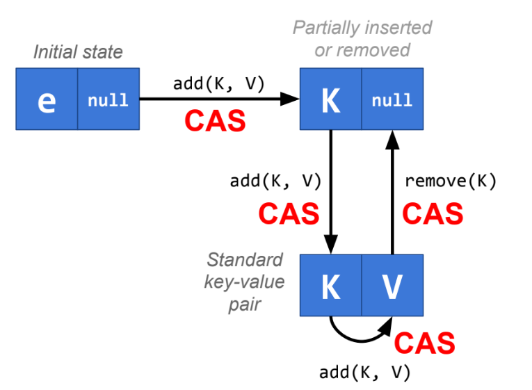
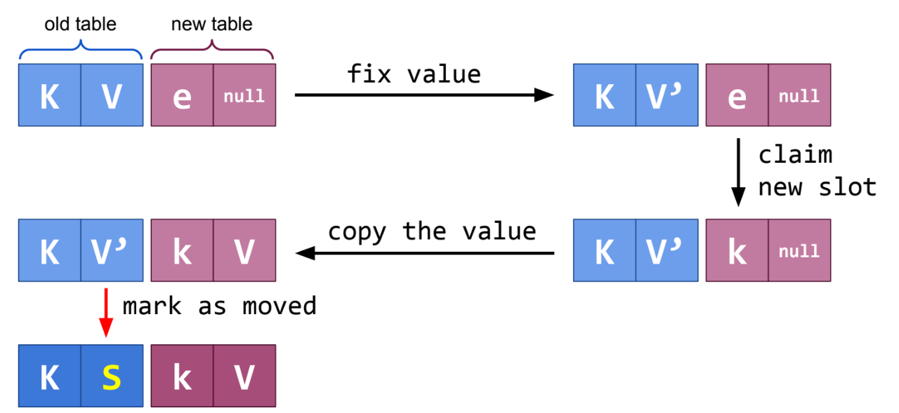

# Лекция 8. Многопоточные хеш-таблицы

Мы будем использовать открытую адресацию ради локальности по кешу. 

Без перестроения таблицы чтения тривиальны, но что делать когда мы перестраиваем таблицу? Будем читать из старого массива и атомарно менять ссылку на массив, когда перестроение закончено.

Когда мы перемещаем ячейку, мы помечаем её как перемещенную и запрещаем ее изменять.

Для конкретных use case'ов можно оптимизировать нашу структуру.
